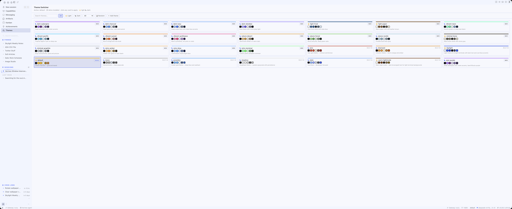
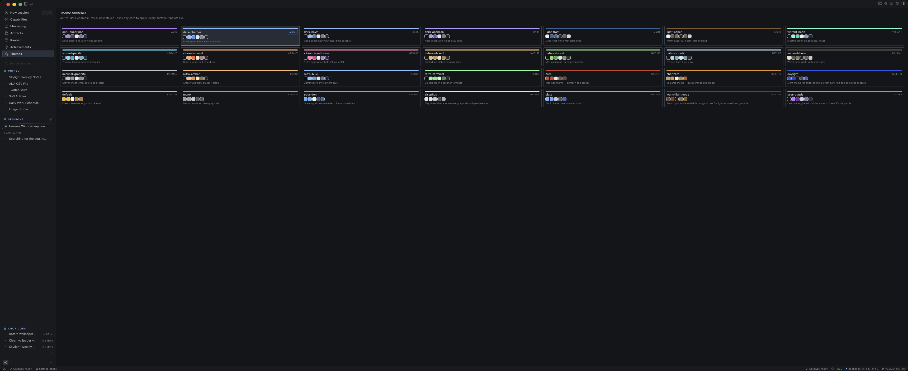

# Hermes Theme Pack

[](https://github.com/CliffWade/hermes-desktop-theme-pack/releases)
[](https://github.com/CliffWade/hermes-desktop-theme-pack/actions/workflows/ci.yml)
[](https://github.com/CliffWade/hermes-desktop-theme-pack/blob/main/LICENSE)

> ## 🚀 100 themes — v1.1.0 is live
>
> One hundred curated color themes, perfectly balanced 50 light / 50 dark,
> and **every single theme has a light/dark twin** — click ⇄ to flip the
> same vibe to the other polarity, or turn on Follow system to have the
> active theme flip automatically when macOS switches appearance. See the
> [release notes](https://github.com/CliffWade/hermes-desktop-theme-pack/releases/tag/v1.1.0) and the [full changelog](CHANGELOG.md).

100 curated color themes for Hermes Agent, organized into 7 categories, every one contrast-checked to WCAG AA. Drop them in and they appear across the CLI, the TUI, and the desktop app at once, because a Hermes skin themes every surface.

## Features

- **100 themes, 7 categories** — Dark, Light, Vibrant, Nature, Minimal, Retro, and Community (10 themes ported from [BeardedChop/hermes-skins-pack](https://github.com/BeardedChop/hermes-skins-pack))
- **WCAG AA contrast gate** — every theme passes primary text at 6:1, accents and secondary text at 4.5:1 against its background, enforced by an independent test suite
- **Themes every surface** — one YAML skin repaints the CLI, the TUI, and the desktop app at once
- **Theme Switcher desktop plugin** — a Themes page in the app sidebar: every skin in one grid, light/dark grouping, search (including palette colors like "purple" or #7b2d8e), hover preview, one-click apply, undo, random, install-from-YAML, statusbar chip, ⌘K palette entry
- **Built-in Appearance integration** — pack themes appear in the desktop's native Appearance settings, Cmd-K, and `/skin` (via THEMES_AREA)
- **Copy YAML to share** — one click on any user theme card exports the raw skin YAML for sharing
- **Add your own theme** — paste YAML in the app, drop a file in `~/.hermes/skins/`, or use the seed-palette generator
- **CI-enforced quality** — every PR runs YAML validation, the WCAG test suite, generator drift checks, and plugin syntax checks automatically
- **Community contribution guide** — [CONTRIBUTING.md](CONTRIBUTING.md) walks contributors through the format, the contrast contract, and verification

In the desktop app, the Theme Switcher page lists every installed skin in a single view, with its real palette, one click to apply. It follows your active skin, so the same page looks like this in light and dark mode:

Light mode (default theme):



Dark mode (dark-charcoal):



## Themes

| Category | Themes |
|---|---|
| **Dark** | dark-aubergine, dark-obsidian, dark-charcoal, dark-navy, dark-crimson, dark-dracula, dark-lcars, dark-plum, dark-bone, dark-mac, dark-lemon, dark-sage, dark-vanilla, dark-solarized, dark-gruvbox, dark-tokyo-night, dark-catppuccin, dark-nord, dark-rosepine, dark-one, dark-everforest, dark-kanagawa, dark-ayu, dark-github, dark-material, dark-vscode, dark-cozy-paper |
| **Light** | light-paper, light-frost, light-cloud, light-cream, light-mint, light-rose, light-sand, light-lavender, light-honey, light-sky, light-peach, light-sage, light-aqua, light-lilac, light-porcelain, light-denim, light-blush, light-grape, light-fern, light-vanilla, light-lemon, light-oat, light-melon, light-tide, light-mist, light-ash, light-dracula, light-lcars, light-stained-glass, light-neon, light-pacific, light-synthwave, light-sunset, light-solarized, light-gruvbox, light-tokyo-day, light-catppuccin, light-nord, light-rosepine, light-one, light-everforest, light-kanagawa, light-ayu, light-github, light-material, light-vscode, light-cozy-paper |
| **Vibrant** | vibrant-synthwave, vibrant-neon, vibrant-sunset, vibrant-pacific |
| **Nature** | nature-forest, nature-nordic, nature-desert, nature-ocean, nature-autumn |
| **Minimal** | minimal-graphite, minimal-bone, minimal-pearl |
| **Retro** | retro-terminal, retro-amber, retro-blue, retro-mac |
| **Community** | vaporwave-mall, stained-glass, shadow-thief, void-sunset, redwood, newsprint-noir, peach-fuzz, slate-mist, steel-thread, warm-ash — ported from [BeardedChop/hermes-skins-pack](https://github.com/BeardedChop/hermes-skins-pack) |

## Theme pairs

Every theme with a light/dark counterpart is paired to the same vibe in the
opposite polarity. In the Theme Switcher, paired themes show `⇄ paired with
<name>` on the card, a ⇄ button applies the twin in one click, and the hover
preview shows both polarities side by side. The pack is 50 light / 50 dark;
every theme is paired — 50 pairs cover all 100 themes.

| Dark | Light | Dark | Light |
|---|---|---|---|
| dark-aubergine | light-lavender | nature-nordic | light-frost |
| dark-ayu | light-ayu | nature-ocean | light-tide |
| dark-bone | minimal-bone | newsprint-noir | light-paper |
| dark-catppuccin | light-catppuccin | peach-fuzz | light-peach |
| dark-charcoal | light-cloud | redwood | light-cream |
| dark-cozy-paper | light-cozy-paper | retro-amber | light-honey |
| dark-crimson | light-rose | retro-blue | light-denim |
| dark-dracula | light-dracula | retro-terminal | light-mint |
| dark-everforest | light-everforest | shadow-thief | light-lilac |
| dark-github | light-github | slate-mist | light-mist |
| dark-gruvbox | light-gruvbox | stained-glass | light-stained-glass |
| dark-kanagawa | light-kanagawa | steel-thread | light-ash |
| dark-lcars | light-lcars | vaporwave-mall | light-aqua |
| dark-lemon | light-lemon | vibrant-neon | light-neon |
| dark-mac | retro-mac | vibrant-pacific | light-pacific |
| dark-material | light-material | vibrant-sunset | light-blush |
| dark-navy | light-sky | vibrant-synthwave | light-synthwave |
| dark-nord | light-nord | void-sunset | light-sunset |
| dark-obsidian | light-porcelain | warm-ash | light-oat |
| dark-one | light-one | nature-autumn | light-melon |
| dark-plum | light-grape | nature-desert | light-sand |
| dark-rosepine | light-rosepine | nature-forest | light-fern |
| dark-sage | light-sage | minimal-graphite | minimal-pearl |
| dark-solarized | light-solarized | dark-vanilla | light-vanilla |
| dark-tokyo-night | light-tokyo-day | dark-vscode | light-vscode |

## Install

```bash
./install.sh
```

Or manually: copy the `.yaml` files from `themes/` into your Hermes skins folder, `~/.hermes/skins/` (profile-aware: `$HERMES_HOME/skins/`).

The desktop app picks up new skins automatically via the backend skin sync. If they don't appear right away, restart the gateway or reload the desktop app.

## Activate

```bash
hermes config set display.skin dark-aubergine
```

Or in the app: `/skin` in the CLI, or Appearance → theme in the desktop app. Every surface repaints live within about a second.

## Adding your own theme

Three ways — and if you want to contribute your theme back to the pack, see [CONTRIBUTING.md](CONTRIBUTING.md) for the full walkthrough:

1. **In the app**: open **Themes**, click **+ Add theme**, paste a skin YAML, and it installs instantly. The backend validates the shape and rejects malformed input, duplicates, and unsafe names.
2. **By hand**: drop a `.yaml` file into `~/.hermes/skins/` (profile-aware: `$HERMES_HOME/skins/`) and it appears everywhere, CLI, TUI, and desktop.
3. **With the generator**: add a seed palette to the `THEMES` list at the top of `scripts/generate_themes.py` and re-run it. The generator derives the full color set and enforces the contrast gate for you.

A minimal hand-written skin:

```yaml
name: my-theme
description: My custom look
colors:
  background: "#1a1a2e"
  ui_accent: "#ffd700"
  banner_text: "#f5f5f5"
  banner_dim: "#8a8a8a"
  banner_border: "#333355"
```

Contrast is your job in the first two options and the generator's job in the third. For hand-written skins, keep primary text at 6:1 and accents at 4.5:1 against the background.

## Quality

Every theme is generated from a seed palette by `scripts/generate_themes.py`, which:

- Derives the full skin color set: background, text hierarchy, accent, borders, status colors, diff colors, syntax colors, completion menu
- Enforces WCAG AA contrast: primary text at 6:1, secondary text and accents at 4.5:1 against the background
- Keeps success, warning, and error recognizable as green, amber, and red
- Uses only `#rrggbb` hex, valid for every surface

Re-run the generator to regenerate all skins and the preview gallery, or edit any `.yaml` by hand and reload.

## Theme Switcher (desktop browser)

The pack also ships a **Theme Switcher** desktop plugin: a "Themes" entry in the app's left sidebar (like Achievements) that lists every installed skin, marks the active one, and applies a new one with one click. No terminal needed to flip themes.

Features:

- **Every skin in one view** — all installed skins in a compact grid, grouped by category, each card showing the real palette (accent line, name, swatches, description)
- **Light / dark symbols** — ☀ marks light-based themes, ☾ marks dark-based, computed from the background luminance
- **Light and dark groups** — themes are sorted into a ☀ Light group and a ☾ Dark group with counts, so the first decision is the polarity one
- **Search and filters** — type to find a theme, filter by ☀ light / ☾ dark, or by category
- **Hover preview** — hover any card to see a mockup of the app rendered in that theme's real colors before you apply it
- **One-click apply** — every surface repaints live through the canonical config writer
- **Undo** — a banner appears after every apply; click Undo to snap back to the previous theme
- **Random** — the 🎲 button applies a random theme from the current filter
- **Add a theme** — paste a skin YAML and it installs into your skins folder and appears on the page instantly (bad YAML, duplicates, and unsafe names are rejected)
- **Statusbar chip** — the bottom bar shows the active theme with its color dot; click to open the Themes page
- **Command palette** — ⌘K → "Themes: Open"

Install the backend and desktop plugin:

```bash
# backend plugin
mkdir -p ~/.hermes/plugins/theme-switcher
cp -R plugins/theme-switcher/* ~/.hermes/plugins/theme-switcher/
hermes plugins enable theme-switcher

# desktop plugin
mkdir -p ~/.hermes/desktop-plugins/theme-switcher
cp desktop-plugin/theme-switcher/plugin.js ~/.hermes/desktop-plugins/theme-switcher/
```

Restart the app once so the backend mounts, then open **Themes** from the sidebar.

## Development

```bash
python3 scripts/generate_themes.py   # regenerates themes/*.yaml + docs/preview.html
uv run pytest tests/ -q               # invariant checks: structure, WCAG gate, idempotency, installer (installs pytest + pyyaml)
open docs/preview.html               # browse the gallery
```

The seed palettes live at the top of the generator script. Add a palette, re-run, and you have a new theme.

## License

MIT.

## Changelog

See [CHANGELOG.md](CHANGELOG.md) for the full history.
