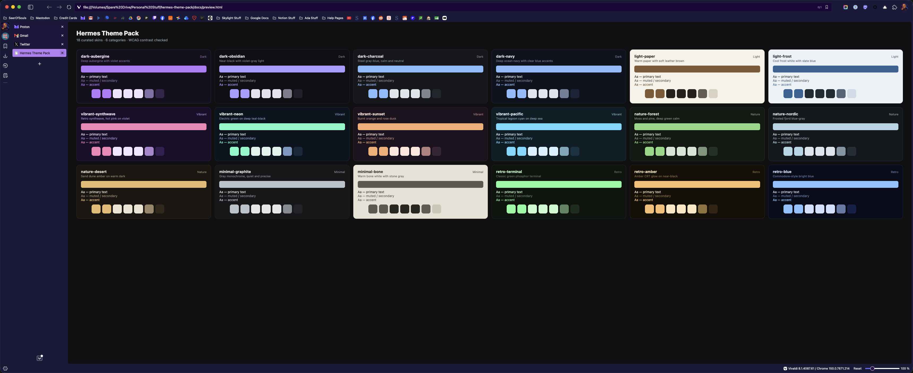

# Hermes Theme Pack

18 curated color themes for Hermes Agent, organized into 6 categories, every one contrast-checked to WCAG AA. Drop them in and they appear across the CLI, the TUI, and the desktop app at once, because a Hermes skin themes every surface.



## Themes

| Category | Themes |
|---|---|
| **Dark** | dark-aubergine, dark-obsidian, dark-charcoal, dark-navy |
| **Light** | light-paper, light-frost |
| **Vibrant** | vibrant-synthwave, vibrant-neon, vibrant-sunset, vibrant-pacific |
| **Nature** | nature-forest, nature-nordic, nature-desert |
| **Minimal** | minimal-graphite, minimal-bone |
| **Retro** | retro-terminal, retro-amber, retro-blue |

## Install

```bash
./install.sh
```

Or manually: copy the `.yaml` files from `themes/` into your Hermes skins folder, `~/.hermes/skins/` (profile-aware: `$HERMES_HOME/skins/`).

The desktop app picks up new skins automatically via the backend skin sync. If they don't appear right away, restart the gateway or reload the desktop app.

## Activate

```bash
hermes config set display.skin dark-aubergine
```

Or in the app: `/skin` in the CLI, or Appearance → theme in the desktop app. Every surface repaints live within about a second.

## Quality

Every theme is generated from a seed palette by `scripts/generate_themes.py`, which:

- Derives the full skin color set: background, text hierarchy, accent, borders, status colors, diff colors, syntax colors, completion menu
- Enforces WCAG AA contrast: primary text at 6:1, secondary text and accents at 4.5:1 against the background
- Keeps success, warning, and error recognizable as green, amber, and red
- Uses only `#rrggbb` hex, valid for every surface

Re-run the generator to regenerate all skins and the preview gallery, or edit any `.yaml` by hand and reload.

## Development

```bash
python3 scripts/generate_themes.py   # regenerates themes/*.yaml + docs/preview.html
open docs/preview.html               # browse the gallery
```

The seed palettes live at the top of the generator script. Add a palette, re-run, and you have a new theme.

## License

MIT.
